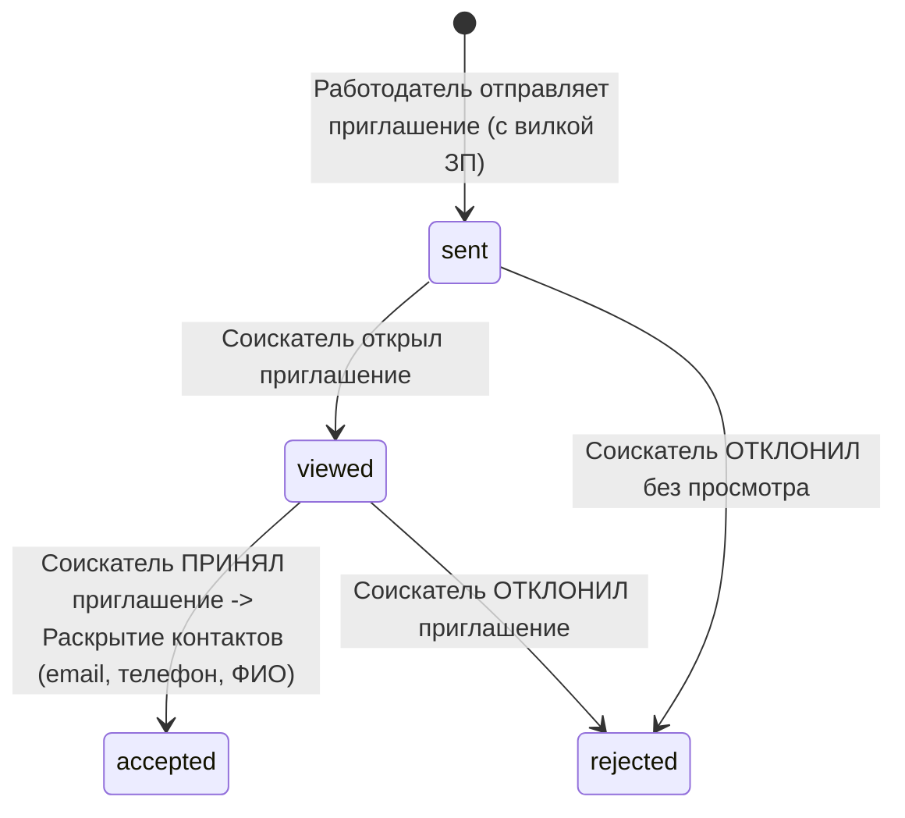

# Документация API платформы HuntMe

Данный раздел содержит описание архитекуры REST API, спецификацию OpenAPI (Swagger) и бизнес-правила взаимодействия
между сервисом, соискателями и работодателями в соответствии с **Техническим заданием (ТЗ)**.

Файл спецификации OpenAPI находится по адресу: [
`api/openapi.yaml`](file:///home/denis/WebstormProjects/HuntMe/api/openapi.yaml).

---

## 1. Ключевые принципы и правила приватности

### 1.1. Анонимизация соискателей до принятия приглашения

В соответствии с ТЗ п. 2.1 и 2.2:

* При поиске и просмотре банка кандидатов работодатель видит **только анонимизированную карточку** соискателя (стек,
  подтвержденный грейд, категорию, результаты тестов, верифицированные достижения ФСП и желаемую ЗП).
* Личные контакты (`fullName`, `email`, `phone`) скрыты (`contactsUnlocked: false`).
* **Раскрытие контактов происходит автоматически только после того, как соискатель примет приглашение работодателя**
  (`POST /candidate/invitations/{id}/accept`).

### 1.2. Обязательность указания зарплатной вилки

* В соответствии с ТЗ п. 2.2 при направлении приглашения работодателем (`POST /employer/invitations`) **поля `salaryMin`
  и `salaryMax` в рублях являются обязательными**.

### 1.3. Привязке и верификации профиля ФСП

* Кандидаты могут связывать профиль с **FSP ID** (`POST /candidate/fsp`).
* При успешной связке система возвращает подтвержденный список достижений (победы и призовые места в хакатонах и
  соревнованиях по спортивному программированию), которые повышают рейтинг соискателя внутри категории при поиске
  работодателем.

---

## 2. Обзор основных эндпоинтов

### 🔑 2.1. Авторизация и профили (Auth & Profiles)

| Метод  | Эндпоинт                | Описание                                                                       | Доступ      |
|--------|-------------------------|--------------------------------------------------------------------------------|-------------|
| `POST` | `/api/v1/auth/refresh`  | Обновление `access_token` по `refresh_token`                                   | Публичный   |
| `GET`  | `/api/v1/auth/me`       | Получение текущего пользователя и его роли                                     | Авторизован |

---

### 👨‍💻 2.2. Личный кабинет соискателя (Candidate Profile & Testing)

| Метод   | Эндпоинт                           | Описание                                                       | Доступ   |
|---------|------------------------------------|----------------------------------------------------------------|----------|
| `GET`   | `/api/v1/candidate/profile`        | Получение полного профиля текущего соискателя                  | Кандидат |
| `POST`  | `/api/v1/candidate/profile`        | Создание профиля текущего соискателя                           | Кандидат |
| `PATCH` | `/api/v1/candidate/profile`        | Обновление данных (стек, стаж, софт-скиллы, желаемая ЗП)       | Кандидат |
| `POST`  | `/api/v1/candidate/profile/resume` | Загрузка PDF резюме с авторазбором (парсинг стека и стажа)     | Кандидат |
| `POST`  | `/api/v1/candidate/fsp`            | Привязка ID участника ФСП и загрузка достижений                | Кандидат |
| `PATCH` | `/api/v1/candidate/privacy`        | Настройки приватности                                          | Кандидат |
| `POST`  | `/api/v1/candidate/testing/survey` | Прохождение первичного опроса по специализации и грейду        | Кандидат |
| `POST`  | `/api/v1/candidate/testing/start`  | Запуск сессии тестирования (получение уникальных заданий)      | Кандидат |
| `POST`  | `/api/v1/candidate/testing/submit` | Отправка ответов на тест и автоматическое присвоение категории | Кандидат |

---

### 💼 2.3. Личный кабинет работодателя и поиск (Employer & Candidate Search)

| Метод  | Эндпоинт                            | Описание                                                                             | Доступ       |
|--------|-------------------------------------|--------------------------------------------------------------------------------------|--------------|
| `GET`  | `/api/v1/employer/company`          | Получение профиля компании                                                           | Работодатель |
| `POST` | `/api/v1/employer/company`          | Создание профиля компании                                                            | Работодатель |
| `PATCH`| `/api/v1/employer/company`          | Обновление профиля компании                                                          | Работодатель |
| `GET`  | `/api/v1/employer/candidates`       | Поиск по банку соискателей с фильтрами (категория, грейд, стек, ФСП, ЗП)             | Работодатель |
| `GET`  | `/api/v1/employer/candidates/{id}`  | Детальный просмотр анонимизированной карточки соискателя                             | Работодатель |
| `POST` | `/api/v1/employer/candidates/match` | Умная подборка кандидатов с текстовым объяснением релевантности (`matchExplanation`) | Работодатель |

---

### 📩 2.4. Механика приглашений и контакт (Invitations & Contact Mechanics)

| Метод  | Эндпоинт                                    | Описание                                                                                              | Доступ       |
|--------|---------------------------------------------|-------------------------------------------------------------------------------------------------------|--------------|
| `POST` | `/api/v1/employer/invitations`              | **Выход на контакт:** отправка предложения кандидату (обязательна вилка ЗП `salaryMin` / `salaryMax`) | Работодатель |
| `GET`  | `/api/v1/employer/invitations`              | Просмотр отправленных приглашений и их статусов (`sent`, `viewed`, `accepted`, `rejected`)            | Работодатель |
| `GET`  | `/api/v1/candidate/invitations`             | Входящие предложения для соискателя с деталями ЗП                                                     | Кандидат     |
| `POST` | `/api/v1/candidate/invitations/{id}/accept` | **Принятие предложения:** статус меняется на `accepted`, **контакты раскрываются работодателю**       | Кандидат     |
| `POST` | `/api/v1/candidate/invitations/{id}/reject` | Отклонение предложения                                                                                | Кандидат     |

---

## 3. Схема статусов взаимодействия (Lifecycle)

---

## 4. Проверка и интеграция OpenAPI

Файл [`api/openapi.yaml`](file:///home/denis/WebstormProjects/HuntMe/api/openapi.yaml) можно открыть через Swagger UI,
Redoc или отвалидировать через OpenAPI CLI.
