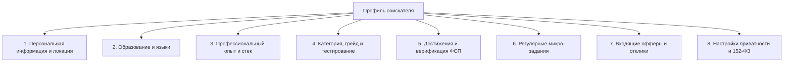

# Личный кабинет соискателя (Candidate Dashboard)

Документ содержит полное иерархическое описание структуры данных, функциональных блоков, правил видимости и
пользовательских сценариев личного кабинета соискателя цифровой платформы **HuntMe** с интеграцией достижений Федерации
спортивного программирования (ФСП).

---

## 1. Концепция и ключевые принципы

- **Обратная механика подбора:** Соискатель не занимается массовой отправкой резюме «вслепую». Он регистрируется,
  подтверждает свою квалификацию через тестирование и привязывает спортивные достижения ФСП. Работодатели сами находят
  кандидата по категоризированной базе и отправляют адресные приглашения с обязательным указанием вилки заработной
  платы.
- **Объективная категоризация:** Грейд и категория кандидата не берутся из самоописанного резюме, а валидируются
  встроенным тестированием.
- **Двухконтурная приватность (152-ФЗ):** В общем поиске профиль кандидата обезличен (работодатель видит категорию,
  стек, грейд, рейтинг и награды ФСП). Прямые контактные данные раскрываются работодателю **исключительно после того**,
  как кандидат принял входящее приглашение или сам откликнулся на открытую вакансию.
- **Двойной формат ввода резюме:** Поддержка как классического пошагового заполнения форм, так и интеллектуального
  автораспознавания PDF-резюме с возможностью обратного экспорта стандартизированного PDF-паспорта HuntMe.

---

## 2. Иерархическая структура данных профиля



---

### 2.1. Персональная информация и контакты

Базовые данные для идентификации и последующей связи.

* **1. Публичные данные (видны работодателю в карточке поиска):**
    * `ФИО` / `Отображаемое имя` (например, *Алексей Иванов* или *Алексей И.* в зависимости от настроек приватности);
    * `Аватар / Фотография профиля`;
    * `Город проживания / Локация` (например, *Москва, Россия*);
    * `Часовой пояс` (например, *UTC+3 / МСК*);
    * `Возраст / Дата рождения` *(опционально)*.
* **2. Приватные контактные данные (скрыты до подтверждения контакта):**
    * `Email` — основной адрес электронной почты (с флагом подтверждения `isEmailVerified`);
    * `Номер телефона` (в международном формате, например, `+7 (999) 123-45-67`);
    * `Мессенджеры и социальные ссылки`:
        * Telegram (username / прямая ссылка);
        * Ссылка на GitHub / GitLab / профиль спортивного программирования (Codeforces, LeetCode);
        * LinkedIn / Хабр Карьера / Портфолио / Личный сайт.

---

### 2.2. Образование и владение языками

Академический фундамент и коммуникативные навыки.

* **1. Образование (Education):**
    * `Уровень образования`:
        * Среднее специальное;
        * Неоконченное высшее;
        * Высшее (Бакалавриат);
        * Высшее (Магистратура);
        * Высшее (Специалитет);
        * Ученая степень (Кандидат / Доктор наук);
    * `Учебное заведение` (наименование университета, института, колледжа);
    * `Факультет / Кафедра`;
    * `Специальность / Направление подготовки` (например, *«Прикладная математика и информатика»*, *«Программная
      инженерия»*);
    * `Год окончания` (или планируемый год выпуска);
    * `Дополнительное образование и курсы`:
        * Название курса / учебного центра (Яндекс Практикум, Академия ШАД, VK Образование и др.);
        * Специализация сертификата;
        * Год завершения, ссылка на электронный сертификат.
* **2. Владение иностранными языками (Languages):**
    * `Список языков`:
        * Язык (Русский, Английский, Китайский, Немецкий и др.);
        * `Уровень владения`:
            * `A1` — Начальный (Beginner);
            * `A2` — Элементарный (Elementary);
            * `B1` — Средний (Intermediate);
            * `B2` — Средне-продвинутый (Upper-Intermediate);
            * `C1` — Продвинутый (Advanced);
            * `C2` — В совершенстве (Proficiency);
            * `Native` — Родной язык;
            * `Technical Only` — Чтение технической документации.

---

### 2.3. Профессиональный опыт, навыки и карьерные предпочтения

Профессиональный профиль для точного алгоритмического матчинга с потребностями работодателей.

* **1. Специализация и роль:**
    * `Основная специализация` (Backend, Frontend, Fullstack, Mobile iOS/Android, DevOps / SRE, Data Engineering, ML/AI,
      QA Automation, Системное программирование);
    * `Дополнительные специализации` *(при наличии)*;
    * `Общий подтвержденный стаж работы в ИТ` (в годах и месяцах).
* **2. История трудоустройства и коммерческий опыт:**
    * Список мест работы (хронологический порядок):
        * Наименование компании / проекта;
        * Должность / Роль в команде (Tech Lead, Senior Developer, Core Backend Engineer);
        * Период работы (`Дата начала` — `Дата окончания` / `По настоящее время`);
        * Описание зоны ответственности и ключевых достижений (в метриках: *«оптимизировал RPS в 3 раза», «спроектировал
          микросервисную архитектуру»*);
        * Использованный стек технологий на данном месте работы.
* **3. Технологический стек (Hard Skills):**
    * `Языки программирования` (`Go`, `TypeScript`, `Python`, `C++`, `Java`, `Rust`, `Kotlin`);
    * `Фреймворки и библиотеки` (`Vue 3`, `React`, `FastAPI`, `Spring Boot`, `Node.js`, `Django`);
    * `Базы данных и хранилища` (`PostgreSQL`, `ClickHouse`, `Redis`, `MongoDB`, `Kafka`, `RabbitMQ`);
    * `Инфраструктура и инструменты` (`Docker`, `Kubernetes`, `CI/CD`, `Linux`, `Terraform`, `gRPC`);
    * Опыт работы с каждым навыком (в годах).
* **4. Гибкие навыки (Soft Skills):**
    * Менторинг и код-ревью;
    * Архитектурное проектирование;
    * Управление техническим долгом;
    * Кросс-командные коммуникации и Agile/Scrum.
* **5. Карьерные и зарплатные ожидания:**
    * `Желаемый уровень заработной платы` (строго в **рублях РФ**, нетто/на руки, фиксированная сумма или вилка);
    * `Формат занятости`:
        * Удаленная работа (Remote);
        * Гибридный график (Hybrid);
        * Работа в офисе (On-site);
    * `Тип занятости` (Полная занятость, Частичная занятость, Проектная работа);
    * `Готовность к релокации` (Да / Нет / В пределах РФ);
    * `Готовность к командировкам`.
* **6. Работа с PDF-резюме:**
    * **Парсинг:** Загрузка существующего резюме соискателя в формате PDF $\rightarrow$ автоматическое заполнение всех
      полей через OCR/NLP;
    * **Экспорт:** Генерация стандартизированного PDF-профиля HuntMe в фирменном стиле ФСП с QR-кодом верификации.

---

### 2.4. Категория, грейд и движок тестирования

Смысловое ядро платформы: объективная оценка компетенций без субъективных самооценок.

* **1. Атрибуты категории:**
    * `Заявленный грейд (Claimed Grade)` — выбирается кандидатом перед тестированием (`Junior`, `Middle`, `Senior`,
      `Lead`);
    * `Верифицированный грейд (Verified Grade)` — грейд, подтвержденный системой по итогам сдачи теста;
    * `Присвоенная категория` — синтетическая сущность: связка *Специализация + Подтвержденный грейд* (например,
      *«Backend-разработчик с опытом (Middle)»*);
    * `Статус тестирования`:
        * `not_started` — тестирование не начато;
        * `survey_passed` — опрос по стеку пройден, сформирован пул задач;
        * `test_in_progress` — тест проходит прямо сейчас (активна сессия и таймер);
        * `verified` — квалификация подтверждена, категория присвоена.
* **2. Прохождение тестовой сессии:**
    * Динамический банк вопросов и кейсов (код-ревью, поиск багов, архитектурные задачи, тестовые вопросы с выбором);
    * Устойчивость к утечкам (динамическая вариативность заданий с равным калибром сложности);
    * Ограничение по времени на тест и на каждое задание;
    * Автоматический скоринг ответов и вычисление процента прохождения.
* **3. История и правила пересдачи:**
    * История попыток: дата, набранный балл, подтвержденный грейд, разбор ошибок по темам;
    * **Защита от принудительного понижения:** при неудачной сдаче на Senior соискателю предлагается подтвердить грейд
      Middle без блокировки профиля;
    * **Ограничение частоты смены грейда:** возможность повысить/пересдать грейд доступна не чаще **1 раза в 3 месяца**;
    * `canRetakeTestAfter` — таймер обратного отсчета до даты открытия следующей попытки пересдачи.

---

### 2.5. Верифицированный профиль ФСП (Спортивное программирование)

Интеграция объективных спортивных достижений от Федерации спортивного программирования России.

* **1. Идентификатор ФСП:**
    * `ФСП ID` (например, `FSP-2026-8849`) — уникальный номер участника в реестре Федерации;
    * Статус привязки аккаунта (интеграция с Keycloak ФСП ID).
* **2. Список верифицированных достижений (FSP Achievements):**
    * `Наименование соревнования / события`:
        * Чемпионат России по спортивному программированию;
        * Кубок Федерации спортивного программирования;
        * Всероссийский хакатон «Лидеры цифровой трансформации» (ЛЦТ);
        * Региональные кубки и студенческие олимпиады ФСП;
    * `Дисциплина`:
        * Алгоритмическое программирование (Competitive Programming);
        * Продуктовое программирование (Хакатоны / MVP разработка);
        * Программирование систем информационной безопасности;
        * Программирование робототехники;
    * `Занятое место / Статус`:
        * 1 место (Победитель);
        * 2–3 место (Призер);
        * Топ-10 / Финалист;
        * Участник основного этапа;
    * `Спортивный разряд / Звание` (при наличии):
        * Мастер спорта России по спортивному программированию;
        * Кандидат в мастера спорта (КМС);
        * 1-й, 2-й, 3-й спортивный разряд;
    * `Дата фиксации результата` и набранные рейтинговые баллы ФСП.
* **3. Визуальные маркеры и влияние на ранжирование:**
    * Фирменные бейджи отличия в цвете `#EC1D35` с эмблемой ФСП;
    * Прямое влияние на позицию соискателя: кандидаты с достижениями ФСП выводятся в топе своей категории при равенстве
      грейда.
* **4. Сценарий без истории ФСП:**
    * Полная валидность профиля: если кандидат не участвовал в турнирах ФСП, профиль отображается стандартно, а
      ранжирование строится на результатах тестирования и релевантности стека.

---

### 2.6. Регулярные микро-задания (Freshness Signal)

Инструмент поддержания профиля в активном статусе.

* **1. Механика микро-кейсов:**
    * Короткие практические задачи от компаний-партнеров или системы (15–20 минут на решение);
    * Формат: предложить алгоритм, найти узкое место в SQL-запросе, предложить архитектурный паттерн.
* **2. Статус актуальности профиля:**
    * Индикатор активности: *«Активен на этой неделе»*, *«Решил 4 микро-задачи за месяц»*;
    * Свежий сигнал для рекрутеров: подтверждение, что соискатель находится в активном поиске и поддерживает форму.

---

### 2.7. Входящие приглашения (Offers) и отклики

Управление входящим потоком предложений от работодателей.

* **1. Входящие приглашения (Direct Invites):**
    * Название компании-работодателя, логотип, сфера деятельности;
    * Позиция и проектная команда;
    * **Обязательная вилка заработной платы** («от–до» строго в рублях РФ);
    * Описание предложения и стека;
    * Статусы приглашения:
        * `Отправлено` (Received) $\rightarrow$ `Просмотрено` (Viewed) $\rightarrow$ `Принято` (Accepted) $\rightarrow$
          `Отклонено` (Declined);
    * Действия соискателя:
        * **«Принять приглашение»** — раскрывает прямые контакты соискателя работодателю и переводит диалог в рабочий
          канал;
        * **«Отклонить»** — архивирует оффер с возможностью указания причины (не подошла вилка, не интересен стек).
* **2. Исходящие отклики соискателя (Secondary Flow):**
    * Реестр открытых вакансий, на которые соискатель откликнулся самостоятельно;
    * Отслеживание статуса рассмотрения работодателем.

---

### 2.8. Настройки безопасности и приватности (152-ФЗ)

* Согласие на обработку и публикацию персональных данных (с фиксацией даты и версии соглашения);
* Управление видимостью профиля (Активен в поиске / Приостановил поиск);
* Управление паролем, сессиями и двухфакторной аутентификацией;
* Интеграция с единой учетной записью ФСП ID (Keycloak).

---

## 3. Архитектура экранов и вкладок Личного Кабинета (UI Tabs)

Для обеспечения чистого UX и соблюдения SRP интерфейс ЛК соискателя декомпозируется на следующие функциональные экраны:

| Вкладка / Экран                    | Содержимое и сценарии                                                                                                                                                                               |
|------------------------------------|-----------------------------------------------------------------------------------------------------------------------------------------------------------------------------------------------------|
| **1. Мой профиль и резюме**        | Персональные данные, образование, языки, опыт работы, стек (hard/soft skills), зарплатные ожидания, загрузка/парсинг PDF, скачивание стандартизированного PDF-резюме HuntMe.                        |
| **2. Квалификация и тестирование** | Текущая категория и подтвержденный грейд, карточка статуса теста, кнопка запуска тестирования / смены грейда, таймер пересдачи (`canRetakeTestAfter`), история результатов и аналитика компетенций. |
| **3. Достижения ФСП**              | Привязка ФСП ID, верифицированные награды, разряды, турниры, фильтр по дисциплинам, бейджи соревновательного рейтинга.                                                                              |
| **4. Входящие предложения**        | Список приглашений от работодателей с обязательными вилками ЗП в рублях, статусы (`Отправлено`/`Принято`/`Отклонено`), управление контактами.                                                       |
| **5. Микро-задачи**                | Банк свежих задач от работодателей для подтверждения активности профиля.                                                                                                                            |
| **6. Мои отклики**                 | Список открытых вакансий, на которые кандидат откликнулся сам.                                                                                                                                      |
| **7. Настройки и безопасность**    | Управление приватностью, согласие 152-ФЗ, смена пароля, статус сессии.                                                                                                                              |

---

## 4. TypeScript-модель данных (DTO Reference)

```typescript
export interface CandidateFullProfile {
  // 1. Персональные данные
  id: string;
  fullName: string;
  avatarUrl?: string;
  city: string;
  timezone: string;
  birthDate?: string;

  // Контактные данные (приватный контур)
  contacts: {
    email: string;
    phone: string;
    telegram?: string;
    github?: string;
    linkedin?: string;
    portfolioUrl?: string;
  };

  // 2. Образование и языки
  education: Array<{
    id: string;
    level: 'secondary' | 'incomplete_higher' | 'bachelor' | 'master' | 'specialist' | 'phd';
    institution: string;
    faculty?: string;
    specialization: string;
    graduationYear: number;
  }>;
  languages: Array<{
    language: string;
    level: 'A1' | 'A2' | 'B1' | 'B2' | 'C1' | 'C2' | 'native' | 'technical';
  }>;

  // 3. Профессиональный профиль
  specialization: string;
  additionalSpecializations?: string[];
  experienceYears: number;
  workHistory: Array<{
    id: string;
    company: string;
    role: string;
    startDate: string;
    endDate?: string;
    isCurrent: boolean;
    description: string;
    technologies: string[];
  }>;
  skills: string[];
  softSkills: string[];
  desiredSalary: number; // Строго в рублях
  workFormat: Array<'remote' | 'hybrid' | 'office'>;
  relocationReady: boolean;

  // 4. Категория и верификация грейда
  claimedGrade: 'Junior' | 'Middle' | 'Senior' | 'Lead';
  verifiedGrade?: 'Junior' | 'Middle' | 'Senior' | 'Lead';
  category?: string; // e.g. "Backend-разработчик с опытом (Middle)"
  testingStatus: 'not_started' | 'survey_passed' | 'test_in_progress' | 'verified';
  lastTestDate?: string;
  canRetakeTestAfter?: string;

  // 5. Достижения ФСП
  fspId?: string;
  fspAchievements: Array<{
    id: string;
    title: string;
    eventType: string;
    rank: string;
    date: string;
    score?: number;
    sportsCategory?: string; // КМС, Мастер спорта, 1 разряд
  }>;

  // 6. Активность
  activityScore: number;
  lastActiveAt: string;
  completedTasksCount: number;

  // 7. Настройки
  isSearchActive: boolean;
  privacyConsent152Accepted: boolean;
}
```
