# Навигационная архитектура и карта маршрутов цифровой платформы HuntMe

Документ фиксирует согласованную архитектуру маршрутизации (Vue Router 4), вложенных страниц (nested routes), лейаутов
(layouts) и интерфейсной навигации для личного кабинета соискателя (Candidate LK) и смежных разделов платформы.

---

## 1. Лейаут-архитектура (Layouts)

В приложении выделяется 3 типа каркасных шаблонов:

1. **`CandidateLayout` (Основной каркас ЛК соискателя):**
    - **Левый сайдбар (`CandidateSidebar.vue`):** адаптивное боковое меню с иконками PrimeIcons, счетчиками активности
      (бейдж новых приглашений) и индикатором верификации ФСП.
    - **Верхняя панель (`DashboardHeader.vue`):** логотип, статус грейда/категории, переключатель темы (dark/light),
      колокольчик уведомлений, меню профиля и выход.
    - **Контентная зона:** хлебные крошки (`Breadcrumb`) и вложенный `<router-view />`.
2. **`FocusLayout` (Сфокусированный режим без отвлечений):**
    - Используется **исключительно** во время прохождения тестирования (`/candidate/testing/session/:sessionId`).
    - Сайдбар, внешние ссылки и отвлекающие элементы скрыты.
    - Отображаются только таймер обратного отсчета, прогресс-бар вопросов, номер текущей задачи и кнопка «Завершить
      досрочно».
3. **`AuthLayout` (Авторизация и онбординг):**
    - Центрированный контейнер для экранов входа, регистрации и подтверждения почты.

---

## 2. Иерархическая карта страниц ЛК Соискателя

```mermaid
graph TD
    Root["/candidate (CandidateLayout)"]
    Root --> Overview["1. Сводка / Дашборд (/overview)"]
    
    Root --> Profile["2. Профиль и резюме (/profile)"]
    Profile --> P_Edit["Конструктор резюме (/edit)"]
    Profile --> P_Preview["Превью глазами работодателя (/preview)"]
    Profile --> P_PDF["PDF-паспорт и импорт (/pdf)"]
    
    Root --> Testing["3. Квалификация и тестирование (/testing)"]
    Testing --> T_Hub["Хаб квалификации (/testing)"]
    Testing --> T_Survey["Выбор специализации и грейда (/survey)"]
    Testing --> T_Session["Фокусный тест с таймером (/session/:id - FocusLayout)"]
    Testing --> T_Result["Результат и подтверждение (/result/:id)"]
    
    Root --> FSP["4. Верификация ФСП (/fsp)"]
    FSP --> F_List["Достижения, разряды, турниры"]
    FSP --> F_Connect["Связка с ФСП ID"]
    
    Root --> Invites["5. Входящие предложения (/invites)"]
    Invites --> I_List["Лента предложений с вилками ЗП в рублях"]
    Invites --> I_Detail["Карточка оффера и контакты (/:id)"]
    
    Root --> Vacancies["6. Вакансии и отклики (/vacancies)"]
    Vacancies --> V_List["Каталог открытых вакансий"]
    Vacancies --> V_Apps["Мои отклики (/applications)"]
    
    Root --> Challenges["7. Микро-задания (/challenges)"]
    
    Root --> Settings["8. Настройки и 152-ФЗ (/settings)"]
    Settings --> S_Privacy["Приватность и 152-ФЗ"]
    Settings --> S_Security["Безопасность и сессии"]
```

---

## 3. Спецификация маршрутов (Routes Specification)

| Путь (Path)                             | Имя маршрута (`name`)       |      Лейаут       | Заголовок (`meta.title`)    | Описание и функционал                                                                     |
|-----------------------------------------|-----------------------------|:-----------------:|-----------------------------|-------------------------------------------------------------------------------------------|
| `/candidate`                            | —                           | `CandidateLayout` | —                           | Редирект на `/candidate/overview`                                                         |
| `/candidate/overview`                   | `candidate-overview`        | `CandidateLayout` | Сводка профиля              | Пульс профиля, плашка новых офферов, подтвержденная категория, статус активности          |
| `/candidate/profile`                    | —                           | `CandidateLayout` | —                           | Редирект на `/candidate/profile/edit`                                                     |
| `/candidate/profile/edit`               | `candidate-profile-edit`    | `CandidateLayout` | Редактирование профиля      | Конструктор резюме: контакты, образование, языки, опыт, hard/soft стек, зарплата в рублях |
| `/candidate/profile/preview`            | `candidate-profile-preview` | `CandidateLayout` | Превью резюме               | Анонимный вид карточки соискателя (как ее видит работодатель)                             |
| `/candidate/profile/pdf`                | `candidate-profile-pdf`     | `CandidateLayout` | Экспорт и парсинг PDF       | Парсинг загруженного PDF-резюме и генерация брендированного PDF-паспорта HuntMe           |
| `/candidate/testing`                    | `candidate-testing-hub`     | `CandidateLayout` | Квалификация и тестирование | Текущий грейд, радар навыков, статус пересдачи (таймер 3 мес.), история попыток           |
| `/candidate/testing/survey`             | `candidate-testing-survey`  | `CandidateLayout` | Выбор направления теста     | Опрос: специализация (Backend, Frontend и др.) и заявленный грейд (Junior/Middle/Senior)  |
| `/candidate/testing/session/:sessionId` | `candidate-testing-session` |   `FocusLayout`   | Тестирование                | Полноэкранный режим сдачи заданий с таймером, вопросами и код-кейсами                     |
| `/candidate/testing/result/:sessionId`  | `candidate-testing-result`  | `CandidateLayout` | Результаты теста            | Набранный балл, подтвержденный грейд, присвоение категории, фидбек                        |
| `/candidate/fsp`                        | `candidate-fsp`             | `CandidateLayout` | Достижения ФСП              | Привязка ФСП ID, турниры, хакатоны, спортивные разряды (КМС/МС), бейджи ФСП               |
| `/candidate/invites`                    | `candidate-invites`         | `CandidateLayout` | Входящие предложения        | Список офферов от работодателей (с обязательными вилками ЗП в рублях, статусы)            |
| `/candidate/invites/:id`                | `candidate-invite-detail`   | `CandidateLayout` | Детали предложения          | Полная карточка предложения; кнопки «Принять» (раскрывает контакты) / «Отклонить»         |
| `/candidate/vacancies`                  | `candidate-vacancies`       | `CandidateLayout` | Вакансии                    | Каталог открытых вакансий компаний с фильтрацией по стеку и вилкам                        |
| `/candidate/vacancies/applications`     | `candidate-my-applications` | `CandidateLayout` | Мои отклики                 | Таблица откликов кандидата со статусами рассмотрения                                      |
| `/candidate/challenges`                 | `candidate-challenges`      | `CandidateLayout` | Микро-задания               | Банк коротких задач для поддержания актуальности профиля и поднятия в выдаче              |
| `/candidate/settings`                   | `candidate-settings`        | `CandidateLayout` | Настройки и приватность     | Настройки согласия 152-ФЗ, видимость профиля, безопасность и сессии                       |

---

## 4. Навигация в интерфейсе (Sidebar & Header)

### 4.1. Элементы бокового сайдбара (CandidateSidebar)

- `pi pi-home` — **Главная сводка** (`/candidate/overview`)
- `pi pi-user` — **Мой профиль** (`/candidate/profile/edit`) *(с индикатором заполненности %)*
- `pi pi-verified` — **Квалификация** (`/candidate/testing`) *(с бейджем текущего грейда)*
- `pi pi-trophy` — **Достижения ФСП** (`/candidate/fsp`) *(с фирменной звездой/логотипом ФСП)*
- `pi pi-envelope` — **Приглашения** (`/candidate/invites`) *(с бейджем количества новых офферов)*
- `pi pi-briefcase` — **Вакансии** (`/candidate/vacancies`)
- `pi pi-code` — **Микро-задания** (`/candidate/challenges`)
- `pi pi-cog` — **Настройки** (`/candidate/settings`)

### 4.2. Верхняя панель (Header)

- Логотип HuntMe + знак ФСП с быстрым возвратом на дашборд;
- Чип текущей верификации (например, `Backend • Middle [ФСП]`);
- Переключатель темной/светлой темы;
- Центр уведомлений (колокольчик с выпадающим списком событий);
- Меню профиля с аватаром, кнопкой переключения роли и выходом.
